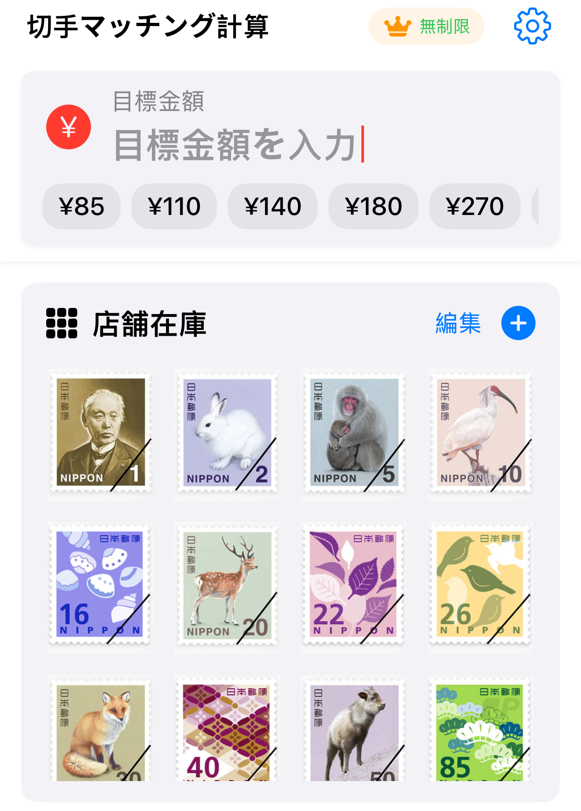
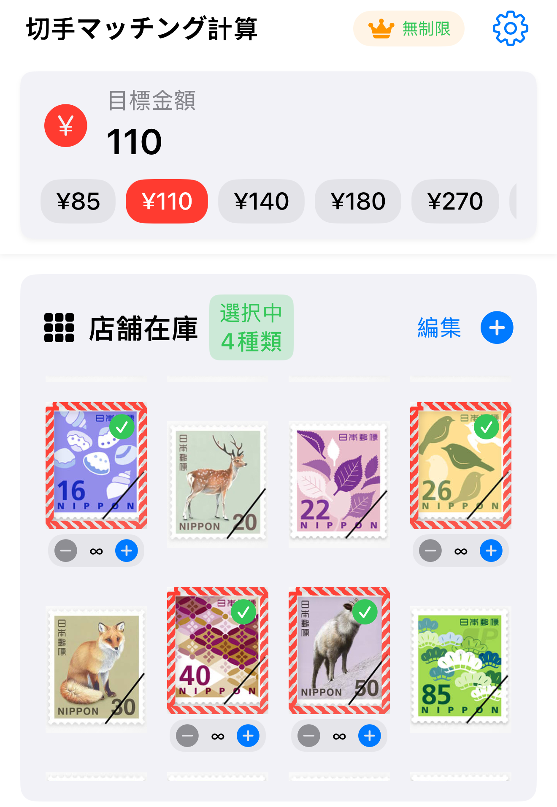

# StampCal - 切手マッチング計算機

  

  <strong>必要な金額の切手をすばやく組み合わせる専門計算ツール</strong> 
  A specialized stamp combination calculator for postal services

  

## 📱 概要 / Overview

StampCalは、特定金額の切手在庫がない時に、小額切手を組み合わせて最適な解決策を提供するiOSアプリです。便利店スタッフや郵便切手を購入する一般消費者向けに設計されています。

StampCal is an iOS app that provides optimal solutions by combining smaller denomination stamps when specific stamp values are out of stock. Designed for convenience store staff and general consumers purchasing postal stamps.

## ✨ 主な機能 / Key Features

- 🎯 **スマート計算** - 目標金額に対する最適な切手の組み合わせを瞬時に計算
- 📊 **複数の最適化方案** - 最小超過、最少枚数、バランス案を同時表示
- 📦 **在庫管理** - 各切手の在庫数量をリアルタイム管理
- 🌏 **多言語対応** - 日本語、英語、中国語（簡体字・繁体字）、韓国語をサポート
- 💾 **履歴機能** - 過去の計算結果を保存・確認可能
- 🎨 **カスタム金額** - 標準額面以外の切手も自由に追加

## 🚀 使用例 / Usage Example

お客様が110円分の切手を必要としているが、110円切手の在庫がない場合：

**利用可能な切手**: 16円、26円、40円、50円

**計算結果**:
- 🎯 最小超過案: 26円×3枚 + 16円×2枚 = 110円（ぴったり・5枚）
- 📉 最少枚数案: 50円×2枚 + 16円×1枚 = 116円（6円超過・3枚）

## 📲 動作環境 / System Requirements

- iOS 15.0以降
- iPhone対応（iPad非対応）
- 縦向き表示のみ

## 🛠 技術スタック / Tech Stack

- **Language**: Swift 5
- **UI Framework**: SwiftUI
- **Architecture**: MVVM
- **Minimum iOS**: 15.0
- **Localization**: 5 languages supported

## 📖 ドキュメント / Documentation

- [プライバシーポリシー / Privacy Policy](https://xjwhnxjwhn.github.io/StampCal/privacy-policy.html)
- [利用規約 / Terms of Use](https://xjwhnxjwhn.github.io/StampCal/terms-of-use.html)

## 💰 料金プラン / Pricing

### 無料版 / Free Version
- 1日9回まで計算可能
- 基本機能すべて利用可能

### Premium版 / Premium Version (¥480/月)
- 無制限の計算回数
- 広告なし
- 優先サポート

## 📧 サポート / Support

ご質問やフィードバックがございましたら、お気軽にお問い合わせください。

- Issues: [GitHub Issues](https://github.com/xjwhnxjwhn/StampCal/issues)

## 🌟 特徴 / Features

- ✅ オフライン対応 - インターネット接続不要
- ✅ 軽量アプリ - ストレージを圧迫しません
- ✅ プライバシー重視 - 個人情報の収集なし
- ✅ 高速計算 - 複雑な組み合わせも瞬時に解決

## 📱 スクリーンショット / Screenshots

  
  
  

## 🔐 プライバシー / Privacy

- 個人情報の収集なし
- すべての計算はデバイス内で完結
- 安心してご利用いただけます

## 📄 ライセンス / License

© 2025 StampCal. All rights reserved.

---

  Made with ❤️ for postal service efficiency

  <strong>🚀 Coming Soon to App Store</strong>

